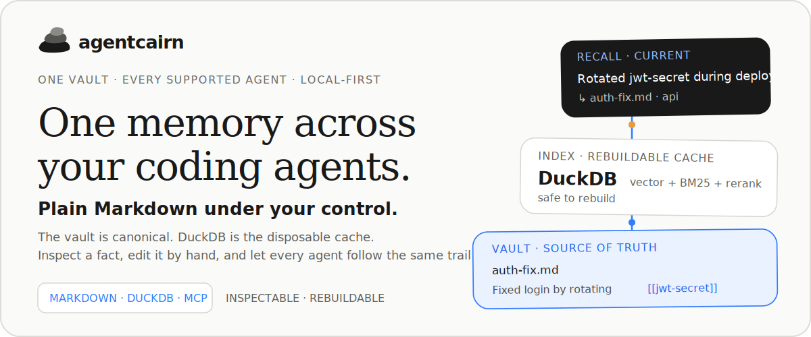
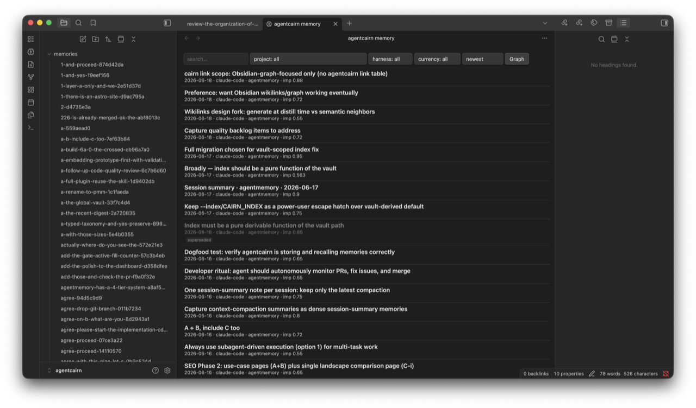
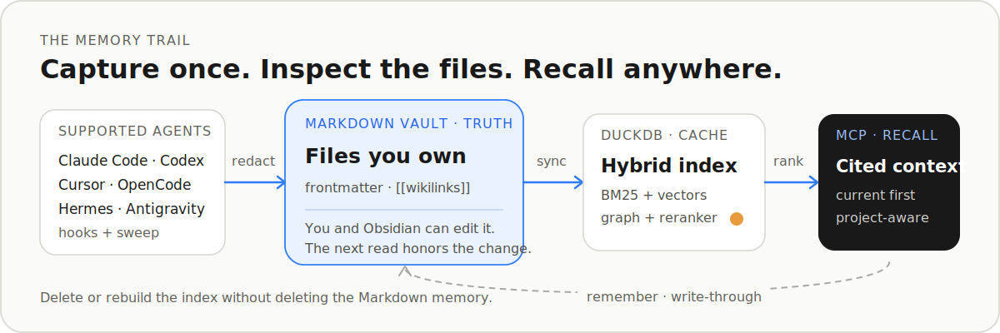

<h1 align="center">
  
</h1>

<p align="center">
  <a href="https://github.com/ccf/agentcairn/actions/workflows/ci.yml"></a>
  <a href="https://github.com/ccf/agentcairn/actions/workflows/trivy.yml"></a>
  <a href="https://pypi.org/project/agentcairn/"></a>
  <a href="https://pypi.org/project/agentcairn/"></a>
  <a href="./LICENSE"></a>
</p>

<p align="center">
  <strong>One durable memory across supported coding agents.</strong><br>
  Your Markdown vault is canonical. DuckDB is the replaceable retrieval cache.
</p>

<p align="center">
  <a href="https://agentcairn.dev">Website</a> ·
  <a href="https://pypi.org/project/agentcairn/">PyPI</a> ·
  <a href="https://github.com/ccf/agentcairn-obsidian">Obsidian companion</a> ·
  <a href="./benchmarks/">Benchmarks</a>
</p>

A cairn marks a trail for whoever comes next. **agentcairn** does that for coding agents: it captures durable context from the tools you use, stores it as inspectable Markdown with provenance, and recalls only the most relevant pieces when another agent needs them.

## Proof you can inspect

The memory is not hidden behind an admin console or a hosted database. The separate [agentcairn-obsidian](https://github.com/ccf/agentcairn-obsidian) companion reads the same Markdown files as the agents and exposes provenance, currency, importance, supersession, and `related:` links.

<p align="center">
  
</p>

<p align="center"><sub>A real agentcairn vault in Obsidian. The list is a view over the files—not a second memory store.</sub></p>

> **Dogfood snapshot · 2026-07-15.** Across 417 local recalls, the maintainer's vault returned context about `262× smaller` than loading the full vault each time—an estimated `136.6M tokens of full-vault context avoided` in aggregate. Token counts use approximately four characters per token. This is not billed-token savings, and agentcairn sends no telemetry.

## Install

The shortest path is a first-class plugin. It bundles the MCP server, the memory skill, and the host-specific ambient hooks—no separate agentcairn package install. The plugin launches through `uvx`, so install [uv](https://docs.astral.sh/uv/getting-started/installation/) first if `uvx --version` is not already available.

### Claude Code

```bash
claude plugin marketplace add ccf/agentcairn
claude plugin install agentcairn@agentcairn
```

Claude Code gets per-turn project-scoped recall, session/compaction capture, and the `/agentcairn:recall`, `/agentcairn:remember`, `/agentcairn:memory`, `/agentcairn:savings`, and `/agentcairn:ingest` commands.

### Codex

```bash
codex plugin marketplace add ccf/agentcairn
codex plugin add agentcairn@agentcairn
```

Codex gets the bundled MCP tools and memory skill, live-verified SessionStart recall, and SessionEnd capture with `cairn sweep` as the out-of-band backstop.

The default vault is `~/agentcairn` and is created on first use. A new empty vault has nothing useful to recall yet, so prove the whole loop explicitly:

```text
You   → Remember this durable fact: staging deploys use blue-green.
Agent → written and indexed
You   → Recall the staging deploy strategy.
Agent → staging deploys use blue-green.  ↳ <memory permalink>
```

`remember` writes the Markdown note and index entry together, so immediate recall is part of the contract. The first local run may download and warm the configured embedding/reranking models.

## The contract

| Promise | What it means in practice |
|---|---|
| **Markdown is canonical** | Notes, frontmatter, and `[[wikilinks]]` are the durable memory. Edit a fact by hand; the next reconciled read honors it. |
| **The index is disposable** | DuckDB is a derived cache. Deleting or rebuilding it does not delete the Markdown vault. |
| **One vault crosses agents** | Supported hosts share the same configured vault instead of building isolated memories per tool. |
| **History is non-lossy** | Derived notes do not silently erase stored notes; superseded and expired facts remain inspectable and are demoted rather than hidden. |
| **Every result has context** | Project, validity status, and permalinks travel with recall so an agent can distinguish current local evidence from cross-project history. |

## How it works

<p align="center">
  <picture>
    <source media="(max-width: 600px)" srcset="./assets/readme/workflow-mobile.svg">
    
  </picture>
</p>

- **Capture:** host hooks improve immediacy; `cairn sweep` reads supported transcript stores out-of-band as the durable backstop. AgentCairn redacts recognized credentials, deduplicates, importance-gates, and distills before its automated plaintext writes.
- **Reconcile:** the first read transactionally brings the vault-scoped index in sync with Markdown. A failed rebuild preserves the last good cache and the durable files remain untouched.
- **Recall:** BM25 and semantic vectors are fused with Reciprocal Rank Fusion, then optionally reranked. Model/provider failures visibly fall back to BM25 with diagnostics instead of returning incompatible vectors.
- **Remember:** the MCP tool atomically writes a Markdown note and updates the index under one writer lock, making a successful save immediately recallable.

## Designed for trust

- **Local by default.** FastEmbed runs locally, the MCP server uses stdio, there is no required daemon or external database, and there is no telemetry.
- **Plain boundaries.** The synced vault contains Markdown; by default, the rebuildable `.duckdb` index stays outside it. Vault symlinks that escape the configured root are rejected.
- **Time-aware corrections.** `valid_from`, `valid_until`, and `superseded_by` keep old evidence visible while making current facts rank first.
- **Deterministic graph.** `[[wikilinks]]` and optional `cairn link` neighbors create an Obsidian-native graph without asking an LLM to invent entities.
- **Project-aware recall.** The current project is boosted by default; cross-project results remain available and are labeled. Automatic recall is project-scoped unless you explicitly opt into all projects.

## Agents supported

Every host resolves the same configured vault. `cairn install` previews detected hosts without writing. MCP configuration writes are backup-first and preserve unrelated servers; plugin-host installs delegate to the host's own CLI.

| Host | Integration | Set up with | Ambient memory |
|---|---|---|---|
| **Claude Code** | Plugin + MCP + skill | `cairn install claude-code` | ✅ per-turn + SessionStart recall; SessionEnd/PreCompact capture |
| **Codex** | Plugin + MCP + skill | `cairn install codex` | ✅ SessionStart recall; SessionEnd capture + sweep |
| **Cursor** | MCP + skill + ingest | `cairn install cursor` | ◐ out-of-band sweep |
| **OpenCode** | Plugin + MCP + ingest | `cairn install opencode` | ✅ per-turn recall + idle/compact capture |
| **Hermes Agent** | Native `MemoryProvider` | [`integrations/hermes/`](integrations/hermes/) | ✅ auto-recall + session-end capture |
| **Antigravity** | Plugin + ingest | `cairn install antigravity --source <dir>` | ◐ out-of-band sweep |
| VS Code (Copilot) | MCP server | `cairn install vscode` | — |
| Claude Desktop | MCP server | `cairn install claude-desktop` | — |
| Any other MCP host | Portable MCP server | `uvx agentcairn` | host-dependent |

Codex SessionStart was verified live end-to-end with agentcairn 0.24.2 / plugin 0.1.2. The installed SessionEnd command dispatch and detached sweep pass exact handler probes; `cairn sweep` remains the out-of-band capture backstop. See the [OpenCode integration](integrations/opencode/) and [Hermes integration](integrations/hermes/) for their native lifecycle details.

## Using it directly

The plugin is the easiest route, but agentcairn is also a standalone CLI and on-demand MCP server. Standalone installs require Python 3.12+.

```bash
uv tool install agentcairn

cairn init ~/agentcairn
cairn sweep --vault ~/agentcairn
cairn recall "how did we fix the auth bug?" --vault ~/agentcairn
cairn doctor --vault ~/agentcairn
```

Prefer an ephemeral process:

```bash
uvx agentcairn                             # MCP server
uvx --from agentcairn cairn recall "..."  # CLI; plain `uvx cairn` is a different package
```

<details>
<summary><strong>CLI maintenance and automation</strong></summary>

```bash
cairn schedule install --vault ~/agentcairn  # launchd on macOS / user crontab on Linux
cairn schedule status
cairn link --vault ~/agentcairn              # write deterministic related: neighbors
cairn reindex ~/agentcairn                   # rebuild the disposable cache
cairn savings                                # local context-efficiency estimate
cairn index-status --vault ~/agentcairn
```

On other operating systems, run `cairn sweep` from your scheduler of choice.

</details>

<details>
<summary><strong>Configuration and optional cloud tiers</strong></summary>

Settings live in `~/.agentcairn/config.toml`; precedence is CLI flag → environment → config file → default.

```bash
cairn config --init
cairn config
```

```toml
auto_recall = true
auto_recall_k = 3
auto_recall_scope = "project"  # use "all" only as an explicit cross-project opt-in
```

Local `nomic-embed-text-v1.5` embeddings are the default. Voyage, OpenAI-compatible embeddings, and the Anthropic durability judge are opt-in. With a cloud provider enabled, remaining secret-redacted note chunks and queries leave the machine; changing the embedding model re-embeds the vault and may incur real latency or API cost.

</details>

## Benchmarks measured

The repository ships a revision-pinned, reproducible [LongMemEval-S + LoCoMo harness](benchmarks/). The default is local `nomic-embed-text-v1.5` plus the cross-encoder reranker.

| Dataset / granularity | Metric | BM25 only | Hybrid RRF | **Hybrid + reranker** |
|---|---:|---:|---:|---:|
| LoCoMo · turn | recall@5 | 0.527 | 0.562 | **0.662** |
| LongMemEval-S · session | recall@5 | 0.920 | 0.954 | **0.969** |
| LongMemEval-S · turn | recall@5 | 0.680 | 0.640 | **0.788** |

Context returned at the default `k=10` is much smaller than the complete indexed history:

| Dataset | Mean full history | Mean recalled | Reduction |
|---|---:|---:|---:|
| LoCoMo (3 conversations) | 25,646 tokens | 529 tokens | **51.1×** |
| LongMemEval-S (full 500) | 136,552 tokens | 2,207 tokens | **64.7×** |

Read the numbers honestly:

- Retrieval recall is not QA accuracy. These tables compare controlled retrieval arms, not end-user answer quality or another product's leaderboard score.
- Token counts use an approximately four-characters-per-token heuristic. The reduction compares the indexed haystack with returned chunks; it is not billed cost savings.
- Graph boost is inert on these chat corpora because they contain no native `[[wikilink]]` graph. It is designed for real interlinked vaults.
- The optional QA judge uses Anthropic rather than the papers' GPT-4o setup, so those QA results are useful for relative ablations—not published-leaderboard comparisons.

Full metrics, embedding sweeps, latency measurements, licenses, commands, and caveats live in [`benchmarks/README.md`](benchmarks/README.md).

## Privacy and limits

- **The vault is plaintext by design, not encrypted storage.** AgentCairn redacts recognized credential patterns before its automated body/title/tag writes; unknown patterns and hand edits remain your responsibility.
- **Cloud features are explicit egress.** The default stays local. Opting into a cloud embedder or LLM judge sends the remaining redacted text to that provider.
- **The project is beta.** Standalone use requires Python 3.12+, and the first local model load can take time. The published retrieval evidence is strongest for conversational memory, not a universal code-search claim.
- **Ambient behavior varies by host.** The matrix above is intentional: Cursor and Antigravity rely on sweep capture; generic MCP hosts may expose tools without lifecycle hooks.
- **Automation is platform-specific.** Managed scheduling targets macOS launchd and Linux user crontab; use your own scheduler elsewhere.

## Development

agentcairn uses [uv](https://docs.astral.sh/uv/) exclusively for dependency management and tooling.

```bash
uv sync
uv run pre-commit install

uv run pytest
uv run ruff format .
uv run ruff check --fix .
uv run pre-commit run --all-files
```

Run the offline benchmark regression without API keys:

```bash
uv run pytest benchmarks/tests/
```

## License

[Apache License 2.0](LICENSE) — permissive, with an explicit patent grant. Copyright © 2026 Charles C. Figueiredo.
